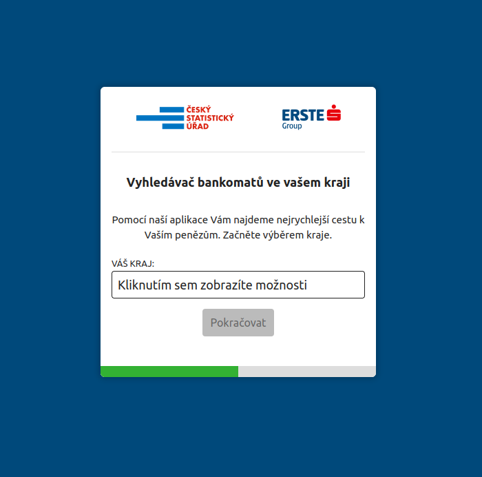

### Demo projekt pro CSAS interview

Jednoduchá aplikace propojující data z dvou API - CZSO a Erstegroup.
Z prvního z nich nabídne uživateli seznam krajů v ČR a v druhém kroku
modalového okna zobrazí města v daném kraji díky datům z banky.

### Požadavky
 - node 16+

### Spuštění lokálního serveru
Jak bundler jsem si vybral Vite. Nainstalujeme si závislosti a spustíme rychlý server:

1. npm install
2. npm run dev

### Omezení & nedostatky

- Pokud uživatel změní své rozhodnutí a vrátí se, provede výběr znovu, uskuteční se nový http požadavek s vyfiltrovaným výsledkem podle jeho dat. Efektivnější by bylo buď data stáhnout a uložit jen jednou a později z nich číst dle podmínek anebo použít API umožňující volat konkrétní endpointy a omezit tak velikost odpovědi do prohlížeče na nezbytné minimum (pokud to API umožňuje, sestavit URL dynamicky rovnou podle vybraných dat: /places/ATM/CZ/…)
- Na některých místech lenivě definuji typ “any” v typescriptu, protože jsem se při plnění úkolu zasekl na nějakém bodě a potřeboval se posunout dál, abych úkol stihl odevzdat
- Stavy mezi jednotlivými kroky jsou uloženy v localStorage, podle zadání. V komplexnější aplikaci bychom toto udržovali ve store (dle mého tedy v reduxu nebo context api)
- Axios funkce vytvářející http požadavky by měly mít ukončovací funkce
- Formulářové prvky nepoužívají hlubší validace, v reálné aplikaci bych volil schema-based validační knihovnu, jednotlivé syntaxe ještě neumím, v povědomí mám Zod, Yup a Joi
- Favicona nemá verzi s maskou pro safari a verzi pro touch a manifest.json
- i18n (Reální aplikace by data získávalá lokalizované, tudíž by se volal nějaký itranslator)
- a11y (patřičné aria tagy)
- Places API (v3) od Erstegroup mi pro typ “ATM” nevrací kraj Hlavního města Praha 🙂